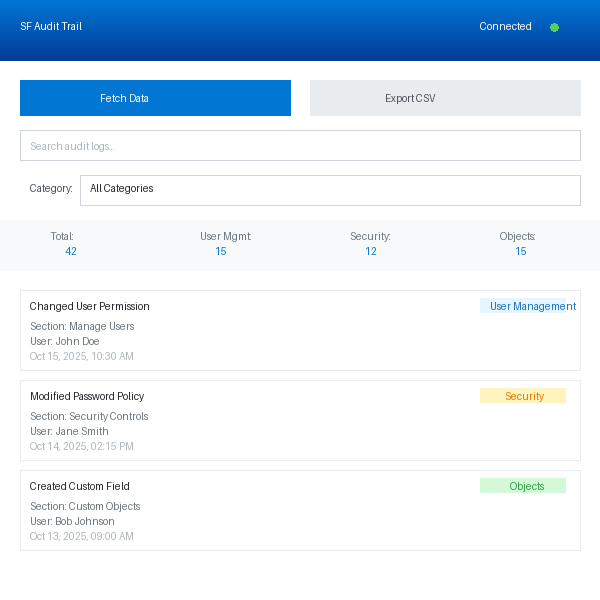

# Salesforce Audit Trail Extractor

A Chrome extension that extracts and analyzes Salesforce Setup Audit Trail data directly from your browser.



## Features

- **Quick Access**: Extract audit trail data directly from a toolbar popup without opening Salesforce Setup
- **6 Month History**: Automatically fetches the last 6 months of audit trail changes
- **Smart Categorization**: Groups logs by category:
  - User Management (users, profiles, permissions, roles)
  - Security (passwords, login settings, certificates)
  - Object Changes (custom objects, fields, workflows, triggers)
- **Fast Search**: Quickly search through audit logs by action, section, user, or details
- **Category Filtering**: Filter logs by specific categories
- **CSV Export**: Export filtered data to CSV for further analysis
- **Simple UI**: Clean, intuitive interface with real-time statistics
- **No OAuth Required**: Uses your active Salesforce session

## Quick Start

**New users**: See the [Quick Start Guide](QUICKSTART.md) for a 5-minute setup!

## Installation

1. Download or clone this repository
2. Open Chrome and navigate to `chrome://extensions/`
3. Enable "Developer mode" (toggle in top right)
4. Click "Load unpacked"
5. Select the `sf-audit-extractor` directory

For detailed instructions, see [INSTALLATION.md](INSTALLATION.md)

## Usage

1. Log in to any Salesforce org
2. Click the extension icon in your Chrome toolbar
3. Click "Fetch Data" to retrieve audit trail logs
4. Use the search box to find specific entries
5. Filter by category using the dropdown
6. Click "Export CSV" to download the data

## How It Works

The extension:
1. Detects when you're on a Salesforce page
2. Extracts your session information from the active tab
3. Uses the Salesforce Tooling API to query SetupAuditTrail records
4. Processes and categorizes the data
5. Displays results in an easy-to-navigate interface

## Technical Details

- **Manifest Version**: 3
- **API Used**: Salesforce Tooling API v58.0
- **Permissions**: activeTab, cookies, storage
- **Supported Domains**: *.salesforce.com, *.force.com

## Files Structure

```
sf-audit-extractor/
├── manifest.json       # Extension configuration
├── popup.html          # Main UI
├── popup.css          # Styles
├── popup.js           # Main logic
├── content.js         # Content script for session extraction
├── background.js      # Service worker for API calls
├── icons/             # Extension icons
│   ├── icon16.png
│   ├── icon32.png
│   ├── icon48.png
│   └── icon128.png
└── README.md
```

## Security

- No data is stored or transmitted to external servers
- Uses read-only API calls to Salesforce
- Session tokens are only used within the browser context
- All processing happens locally in your browser

## Requirements

- Google Chrome (or Chromium-based browser)
- Active Salesforce session
- Appropriate permissions to view Setup Audit Trail in Salesforce

## Troubleshooting

**"Not on Salesforce" error**: Make sure you're on a Salesforce page before using the extension.

**"Not logged in" error**: Ensure you're logged into your Salesforce org.

**No data returned**: Check that you have permission to view Setup Audit Trail in Salesforce.

**API errors**: The extension uses the Tooling API which requires API access. Check your profile permissions.

## License

MIT License - See LICENSE file for details

## Contributing

Contributions are welcome! Please feel free to submit a Pull Request.
